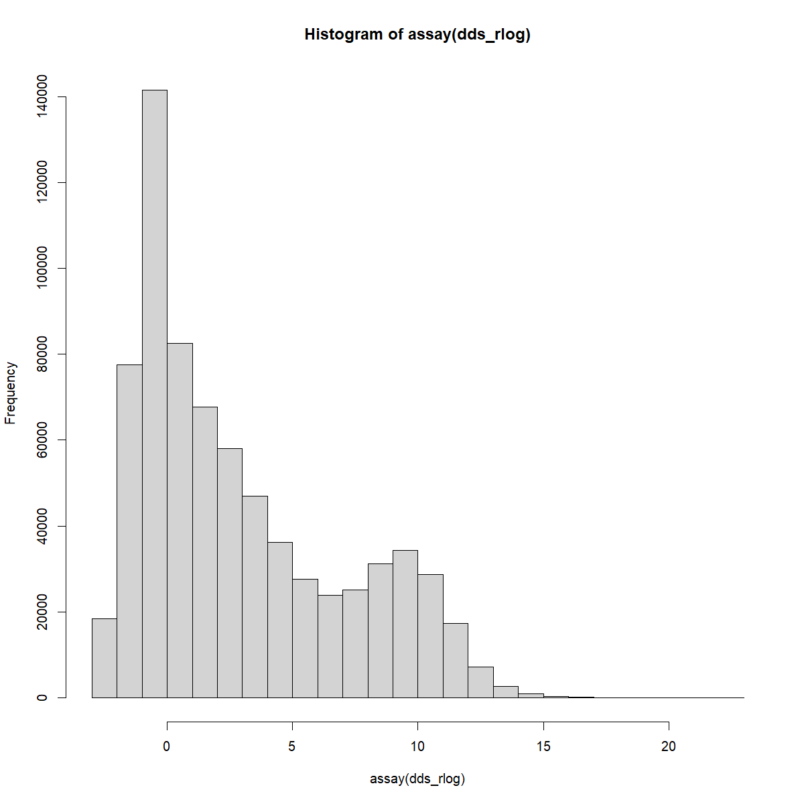
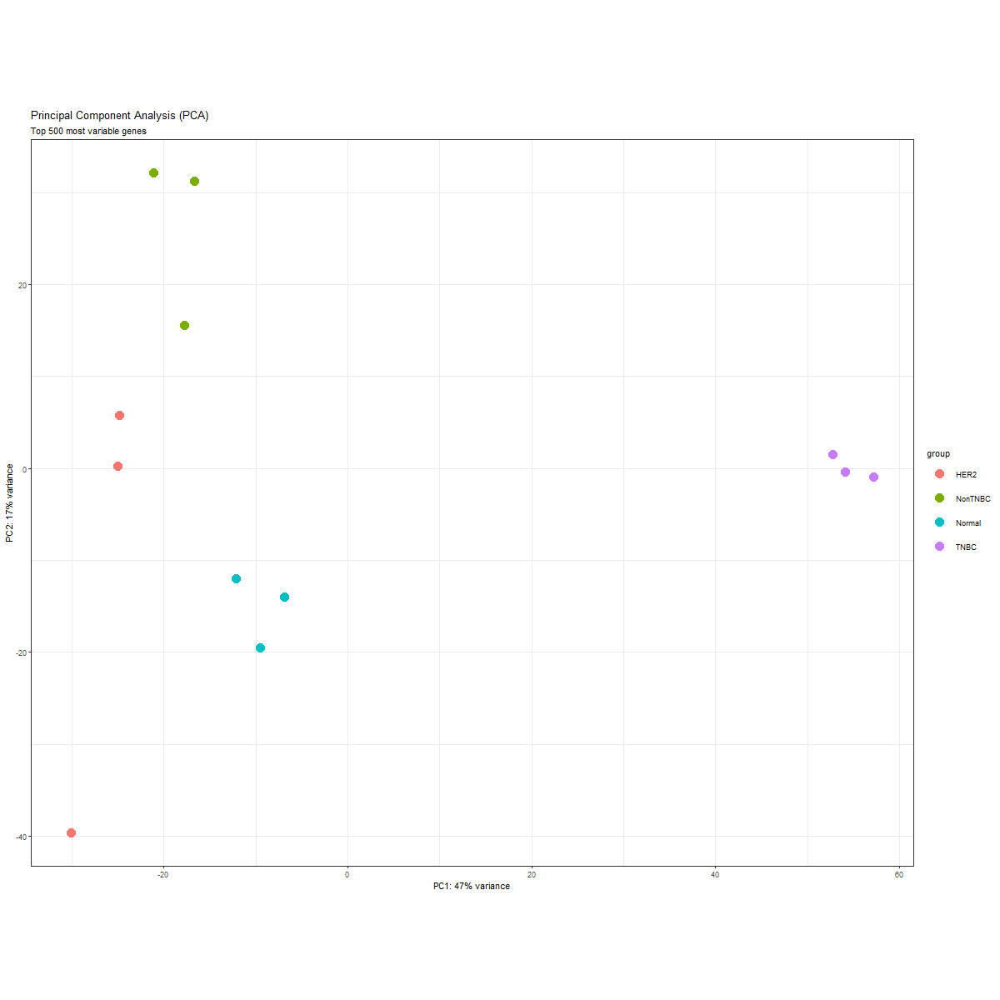
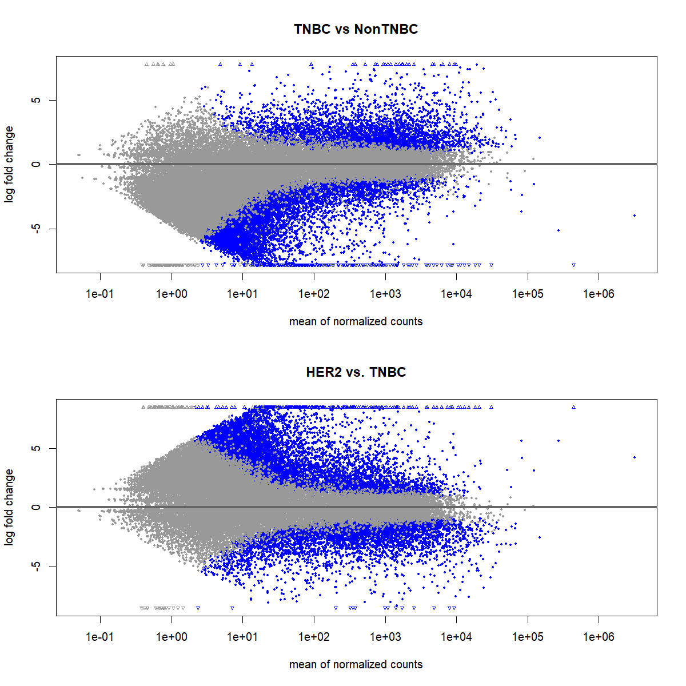
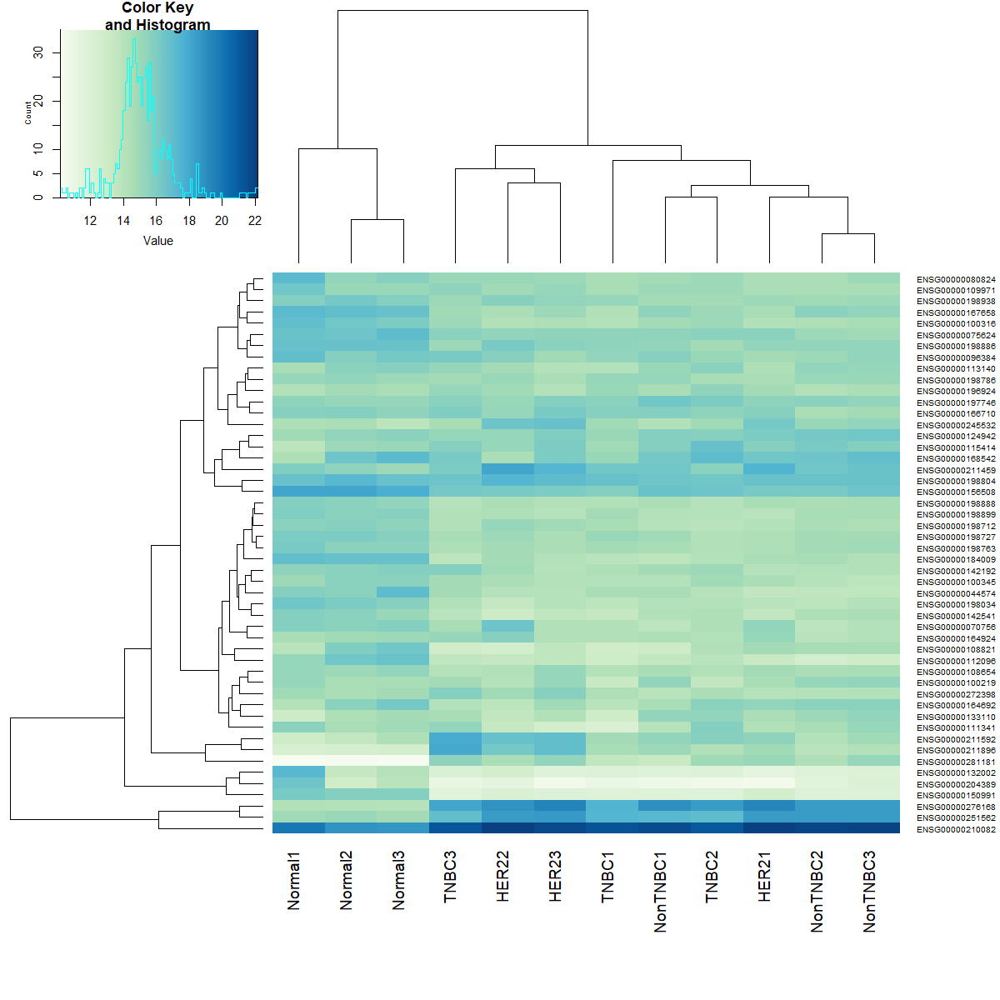
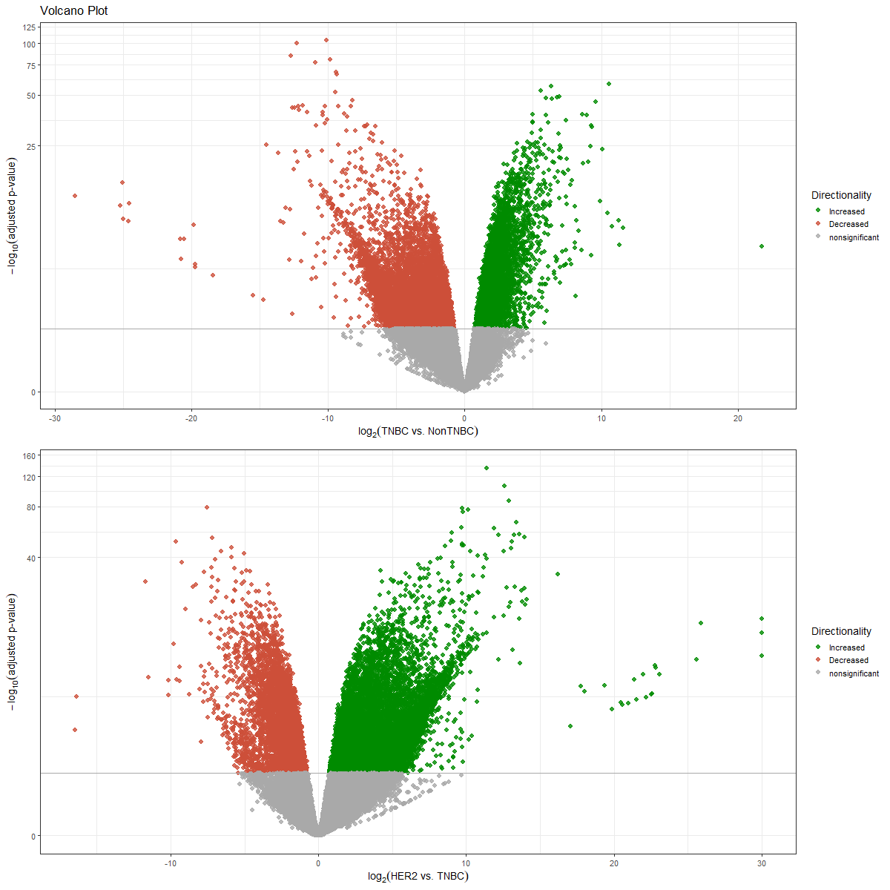
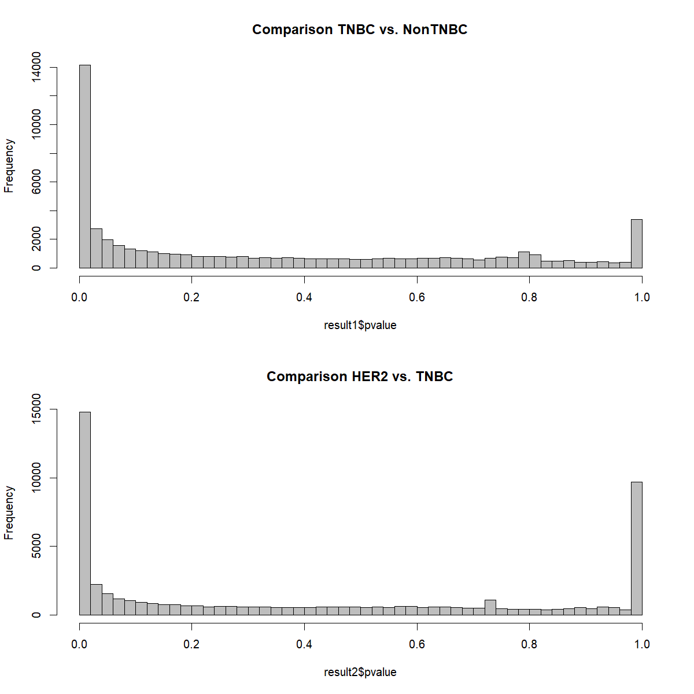
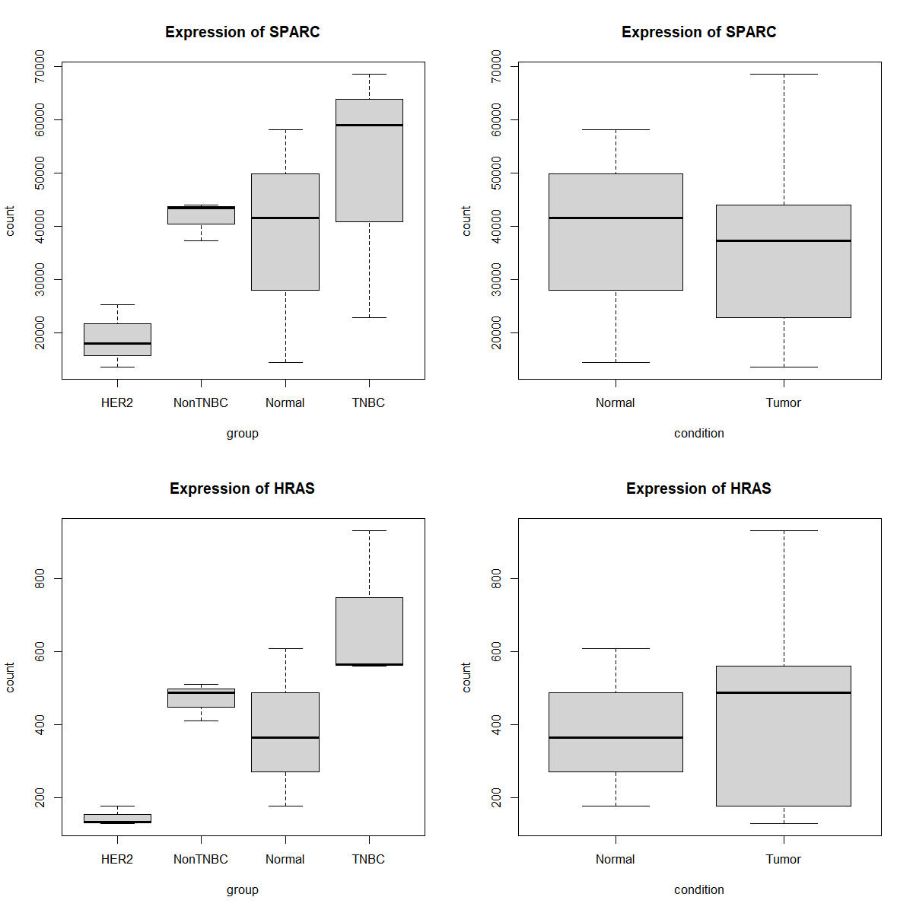

```{r setup, include=FALSE}
knitr::opts_chunk$set(echo = TRUE)
```

## Load librarys and data


```{r include=FALSE, results='hide', echo=T}
library(DESeq2)
library(clusterProfiler)
library(org.Hs.eg.db)
library(DOSE)
library(ggplot2)
library(dplyr)
library(forcats)
library(enrichplot)
library(ggstance)
library(ggupset)
library("RColorBrewer")
library("gplots")
```
```{r}
fcdata <- read.table("featurecounts.txt", header=TRUE, row.names=1)
# head(fcdata)
```


## Exploratory data analysis

Check gene expression patterns and remove first five columns, by removing (chr, start, end, strand, length)

```{r}
fcdata <- fcdata[ ,6:ncol(fcdata)]
```

Extract file names. i.e. `...bam.NonTNBC3_align.sorted.bam` to `NonTNBC3`

```{r }
colnames(fcdata) <- gsub("_align.sorted.bam$", "", colnames(fcdata))
colnames(fcdata) <- gsub("^.*bam\\.", "", colnames(fcdata))
# head(fcdata)
```
Use `DESeq2::DESeqDataSetFromMatrix()` to read in the counts from FeatureCounts and specifying the experimental group of each sample

```{r}
fcdata <- as.matrix(fcdata)
group <- factor(c(rep("HER2", 3), rep("NonTNBC", 3), rep("TNBC", 3), rep("Normal", 3)))
condition = factor(c(rep("Tumor", 9), rep("Normal", 3)))
coldata <- data.frame(row.names=colnames(fcdata), group, factor(c("1", "2", "3", "1", "2", "3", "1", "2", "3", "1", "2", "3")), condition)

dds <- DESeq2::DESeqDataSetFromMatrix(countData=fcdata, colData=coldata, design=~group + factor(c("1", "2", "3", "1", "2", "3", "1", "2", "3", "1", "2", "3")))

```

Run the `DESeq2::DESeq`()` function and save its output to a variable. 

```{r echo=T, results='hide'}
dds <- DESeq2::DESeq(dds)
```

Remove the dependence of the variance on the mean by running `DESeq2::rlog()` on dds. For visualisation, we typically do not want to consider the experimental groups and set blind=TRUE. See here for background.

```{r echo=T, results='hide'}
dds_rlog <- DESeq2::rlog(dds, blind=TRUE)
png("dds_rlog.png", 1200, 1200, pointsize=20)
hist(assay(dds_rlog))
dev.off()
```

```{r }

```

Assess how the samples cluster based on their gene expression profiles using, for example, `DESeq2::plotPCA()`. Draw PCA using the 500 most variably expressed genes
```{r echo=T, results='hide'}
png("PCA.png", 1200, 1200, pointsize=20)
DESeq2::plotPCA(dds_rlog, intgroup="group", ntop=500) +
  theme_bw() + # change theme
  geom_point(size=5) + # add point size
  ggtitle(label="Principal Component Analysis (PCA)", subtitle="Top 500 most variable genes")
dev.off()
```
```{r }

```


## Differential expression analysis

 Extract the results for at least one pairwise contrast and order them by adjusted p-value

```{r}
result1 <- DESeq2::results(dds, contrast=c("group", "TNBC", "NonTNBC"), alpha = 0.05)
result1 <- result1[order(result1$padj), ]

result2 <- DESeq2::results(dds, contrast=c("group",  "HER2", "TNBC"), alpha = 0.05)
result2 <- result2[order(result2$padj), ]

sum(result1$padj < 0.05, na.rm=TRUE)
sum(result2$padj < 0.05, na.rm=TRUE)

summary(result1)
summary(result2)
```

Mean expression against log-fold change. Genes with p-adjusted below alpha will be shown in blue, all others in grey. These figures are not very often used now.
```{r MA, echo=T, results='hide'}
png("MA.png", 1200, 1200, pointsize=20)
par(mfrow=c(2,1))
plotMA(result1, main="TNBC vs NonTNBC", alpha=0.05)
plotMA(result2, main="HER2 vs. TNBC", alpha=0.05)
dev.off()
```
```{r }

```

Heatmap using the 50 most highly expressed genes

```{r echo=T, results='hide'}
png("Heatmap.png", 1200, 1200, pointsize=20)

select <- order(rowMeans(counts(dds,normalized=TRUE)),decreasing=TRUE)[1:50]
hmcol <- colorRampPalette(brewer.pal(9, "GnBu"))(100)
heatmap.2(assay(dds_rlog)[select,], col = hmcol, trace="none", margin=c(10,6),labCol=colnames(dds), cexRow = 1/log10(length(select)))
dev.off()
```
```{r}

```


```{r vulcano }
png("vulcano.png", 1200, 1200, pointsize=20)

vol_data1 <- data.frame(gene=row.names(result1), pval=-log10(result1$padj), lfc=result1$log2FoldChange)
# remove na
vol_data1 <- na.omit(vol_data1)
# set upper and lower threshold
vol_data1 <- mutate(vol_data1, color=case_when(
    vol_data1$lfc > 0 & vol_data1$pval > 1.3 ~ "Increased",
    vol_data1$lfc < 0 & vol_data1$pval > 1.3 ~ "Decreased",
    vol_data1$pval < 1.3 ~ "nonsignificant"))
vol1 <- ggplot(vol_data1, aes(x=lfc, y=pval, color=color))

vol_data2 <- data.frame(gene=row.names(result2), pval=-log10(result2$padj), lfc=result2$log2FoldChange)
# remove na
vol_data2 <- na.omit(vol_data2)
# set upper and lower threshold
vol_data2 <- mutate(vol_data2, color=case_when(
    vol_data2$lfc > 0 & vol_data2$pval > 1.3 ~ "Increased",
    vol_data2$lfc < 0 & vol_data2$pval > 1.3 ~ "Decreased",
    vol_data2$pval < 1.3 ~ "nonsignificant"))
vol2 <- ggplot(vol_data2, aes(x=lfc, y=pval, color=color))
library(cowplot)
plot_grid(vol1 +  ggtitle(label="Volcano Plot") +
            geom_point(size=2.5, alpha=0.8, na.rm=T) +
  scale_color_manual(name="Directionality",
                     values=c(Increased="#008B00", Decreased="#CD4F39",
                              nonsignificant="darkgray")) +
theme_bw(base_size=14) +
theme(legend.position="right") +
xlab(expression(log[2]("TNBC vs. NonTNBC"))) +
ylab(expression(-log[10]("adjusted p-value"))) +
geom_hline(yintercept=1.3, colour="darkgrey") +
scale_y_continuous(trans="log1p")

, vol2 + geom_point(size=2.5, alpha=0.8, na.rm=T) +
  scale_color_manual(name="Directionality",
                     values=c(Increased="#008B00", Decreased="#CD4F39",
                              nonsignificant="darkgray")) +
theme_bw(base_size=14) +
theme(legend.position="right") +
xlab(expression(log[2]("HER2 vs. TNBC"))) +
ylab(expression(-log[10]("adjusted p-value"))) +
geom_hline(yintercept=1.3, colour="darkgrey") +
scale_y_continuous(trans="log1p")
, byrow = TRUE, nrow = 2)
dev.off()
```

```{r }

```

Merge with normalized count data

```{r}
resdata1 <- merge(as.data.frame(result1), as.data.frame(counts(dds, normalized=TRUE)), by="row.names")
resdata2 <- merge(as.data.frame(result2), as.data.frame(counts(dds, normalized=TRUE)), by="row.names")
names(resdata1)[1] <- "Gene"
names(resdata2)[1] <- "Gene"
```

```{r}
# write csv
write.csv(resdata1, file="diffexpr-results_1.csv")
write.csv(resdata2, file="diffexpr-results_2.csv")
```

```{r echo=T, results='hide'}
png("p_values.png", 1200, 1200, pointsize=20)
par(mfrow=c(2,1))
hist(result1$pvalue, breaks=50, col="grey", main = "Comparison TNBC vs. NonTNBC")
hist(result2$pvalue, breaks=50, col="grey", main = "Comparison HER2 vs. TNBC")
dev.off()
```

```{r }

```

```{r echo=T, results='hide'}
# Expression comparison of chosen genes 
png("expression.png", 1200, 1200, pointsize=20)
par(mfrow=c(2,2))

SPARC <- plotCounts(dds, "ENSG00000113140", returnData = TRUE)
boxplot(count ~ group , data=SPARC, main = "Expression of SPARC")
boxplot(count ~ condition , data=SPARC, main = "Expression of SPARC")

HRAS <- plotCounts(dds,"ENSG00000174775", returnData = TRUE)
plot(count ~ group , data=HRAS, main = "Expression of HRAS")
plot(count ~ condition , data=HRAS, main = "Expression of HRAS")
dev.off()

```
```{r }

```

```{r}
# Output data frame 
as.data.frame(SPARC)
as.data.frame(HRAS)


```


## Overrepresentation analysis

```{r echo=T, results='hide'}
# GO of pairwise comparison
data1     <-  resdata1
geneList <- as.character(data1$Gene)
data(geneList)
de       <- names(geneList)[abs(geneList) > 2]

gene.df1 <- bitr(de, fromType = "ENTREZID",
                 toType = c("ENSEMBL", "SYMBOL"),
                 OrgDb = "org.Hs.eg.db")

data2     <-  resdata2
geneList <- as.character(data2$Gene)
data(geneList)
de       <- names(geneList)[abs(geneList) > 2]

gene.df2 <- bitr(de, fromType = "ENTREZID",
                 toType = c("ENSEMBL", "SYMBOL"),
                 OrgDb = "org.Hs.eg.db")
```


```{r}
# GO 
ego1  <- enrichGO(gene         = gene.df1$ENSEMBL,
                  OrgDb         = "org.Hs.eg.db",
                  keyType       = 'ENSEMBL',
                  ont           = "BP",
                  pAdjustMethod = "BH",
                  pvalueCutoff  = 0.05,
                  readable      = TRUE)
head(ego1)

ego2  <- enrichGO(gene         = gene.df2$ENSEMBL,
                  OrgDb         = "org.Hs.eg.db",
                  keyType       = 'ENSEMBL',
                  ont           = "BP",
                  pAdjustMethod = "BH",
                  pvalueCutoff  = 0.05,
                  readable      = TRUE)
head(ego2)
```

```{r}
png("goplot1.png", 1200, 1200, pointsize=20)
goplot(ego1, showCategory = 10, max.overlaps=30)
dev.off()
```
```{r}
png("goplot2.png", 1200, 1200, pointsize=20)
goplot(ego2, showCategory = 10, max.overlaps=30)
dev.off()
```
```{r}

png("barlot1.png", 1200, 1200, pointsize=20)
barplot(ego1, x = 'Count', color = 'p.adjust',showCategory=10)
dev.off()
```
```{r}

png("barlot2.png", 1200, 1200, pointsize=20)
barplot(ego2, x = 'Count', color = 'p.adjust',showCategory=10)
dev.off()
```


```{r echo=T, results='hide', figures-side, fig.show="hold", out.width="50%"}
# mutate and simplify
t1 <- simplify(mutate(ego1, qscore = -log(p.adjust, base=10)), cutoff = 0.7, by = "p.adjust")
t2 <- simplify(mutate(ego2, qscore = -log(p.adjust, base=10)), cutoff = 0.7, by = "p.adjust")


```

```{r}
# Visualization dot plot
png("dotplot1.png", 1200, 1200, pointsize=20)
dotplot(t1, showCategory=14) + ggtitle("Over-representation analysis")
dev.off()
```
```{r}
png("dotplot2.png", 1200, 1200, pointsize=20)
dotplot(t2, showCategory=14) + ggtitle("Over-representation analysis")
dev.off()
```

```{r }
knitr::include_graphics(c("dotplot1.png", "dotplot2.png"))
```

